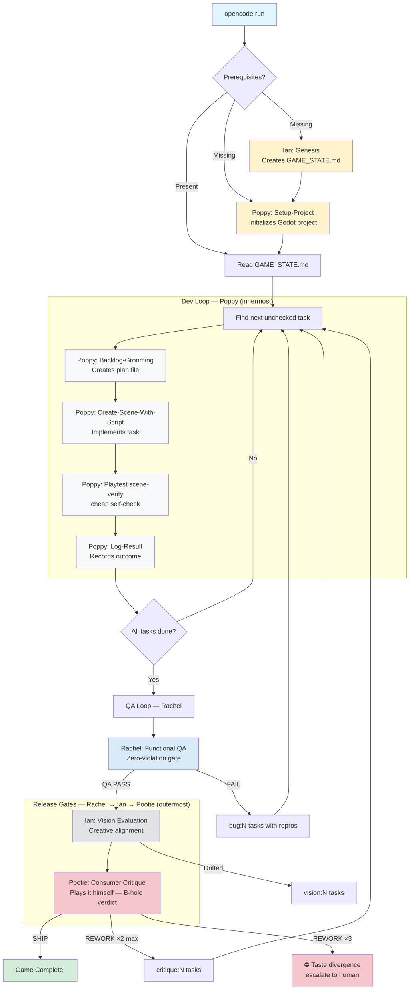

# MythicQuest

Autonomous Godot game generation powered by opencode's agent architecture.

## Quick Start

```bash
# One command builds the entire game:
opencode run "Build a pong-like game"
```

That's it. The build agent handles everything automatically:
- ✅ Checks prerequisites (GAME_STATE.md, project.godot) → creates them if missing
- ✅ Runs the dev loop (Poppy), QA loop (Rachel), and release gates (Ian → Pootie)
- ✅ Plans, implements, self-checks each task; Rachel smoke-tests at milestones
- ✅ Runs final QA → vision → consumer critique when complete

## Core Philosophy

**Agent-based orchestration, not bash scripts.**

MythicQuest replaced complex pipeline scripts with a simple build agent system prompt. Benefits:

- **Simple agent roles** — Each agent has a clear responsibility (planning vs implementation)
- **Embedded validation** — Each skill has success criteria built-in, validated automatically
- **Error handling in context** — Build agent retries blocked tasks, continues loop gracefully
- **True autonomy** — Single command from scratch to playable game
- **Guardrails enforced by permissions, not just prose** — the build agent's `edit`/`bash`/engine-tool access is structurally denied outside status files, so it *cannot* bypass its subagents even under pressure.

## Architecture

### Agents and Skills

MythicQuest uses a **root-level agent library** structure for reusability:

```
MythicQuest/                    # Reusable agent library
├── agents/                     # Agent definitions
│   ├── build.md               # Primary agent (game builder)
│   ├── ian.md                 # Creative Director / Vision QA
│   ├── poppy.md               # Lead Engineer + Planner
│   ├── rachel.md              # QA Engineer (invariant gate)
│   └── pootie.md              # Streamer Critic (consumer gate)
├── skills/                     # Skill implementations
│   ├── genesis/
│   ├── setup-project/
│   ├── create-scene-with-script/
│   ├── backlog-grooming/
│   ├── log-result/
│   └── playtest/
├── opencode.jsonc              # MCP/LSP configuration
└── test/                        # Benchmark sandbox (disposable; prepared by the benchmark-prep skill)
    └── .opencode/              # git submodule -> this repo, pinned at a committed SHA
```

**To consume this library in a real game project, an `.opencode/` runtime view must exist at the consumer project's root** — either a git submodule pointing at this repo (production; the layout `test/` above uses), or a directory of symlinks (`agents`, `skills`, `opencode.jsonc`) back to a checkout of this repo (development only). Full setup recipes — including the path conventions that make skill cross-references resolve — are documented in [AGENTS.md § Library Consumption Pattern](AGENTS.md#library-consumption-pattern).

| Agent | Role |
|-------|------|
| **build** | Game builder, delegates to subagents |
| **ian** | Creative Director, planning & evaluation |
| **poppy** | Lead Engineer, MCP-based implementation |
| **rachel** | QA Engineer, invariant gate — reports bugs, never fixes |
| **pootie** | Streamer Critic, code-blind consumer gate |

### MCP + LSP Integration

MythicQuest uses both MCP and LSP for comprehensive Godot development:

| Protocol | Purpose | Tool |
|----------|---------|------|
| **MCP** (Model Context Protocol) | Scene creation, script writing, project control | `godot-mcp-runtime` |
| **LSP** (Language Server Protocol) | GDScript autocomplete, diagnostics, navigation | `opencode-godot-lsp` |

**MCP** enables agents to create scenes, attach scripts, run projects, and simulate inputs.

**LSP** provides real-time code intelligence while editing `.gd` files (autocomplete, error detection, go-to-definition).


## How It Works

### Autonomous Mode (recommended)

```bash
opencode run "Build a pong-like game"
```

The build agent orchestrates the entire development lifecycle:



**Key orchestration patterns:**
1. **Four loops, one queue** — dev loop (Poppy), QA loop (Rachel), vision loop (Ian), consumer loop (Pootie) all append tagged tasks (`bug:`, `vision:`, `critique:`) to the same `GAME_STATE.md` backlog instead of doing ad-hoc rework in their own sessions.
2. **Sequential OR parallel delegation** — Build agent tasks one subagent per session, spawning parallel subagent sessions only when the next 2-3 tasks are independent (no shared files, no interdependencies).
3. **State-driven loop** — Reads `GAME_STATE.md` to determine next action.
4. **Automatic retry** — If validation fails, task remains unchecked and gets retried (bounded by the 3-attempt circuit breaker).
5. **Layered quality gates** — Rachel's zero-violation gate → Ian's vision gate → Pootie's consumer verdict. Each FAIL routes new tasks back into the queue.
6. **Bounded outer loop** — A Pootie REWORK triggers a fix-and-replay cycle capped at 2; a third REWORK verdict is taste divergence and escalates to the human. The whole cycle is also bounded by the `agent.build.steps` structural iteration cap (`opencode.jsonc`).
7. **Consumer loop is skippable** — benchmark operators can set `SKIP_CONSUMER_LOOP=true` (recorded in GAME_STATE.md); Phase 3 then ends after the vision gate and the completion report notes the skip.

## Validation

Each skill includes **embedded success criteria**. After running a skill, the build agent checks completion using its own tools — `glob()` for file existence, `read()`/`grep()` for content:

```
# Example: verify genesis created a valid GAME_STATE.md
glob("GAME_STATE.md")                              # ✓ File exists
grep("## Task Backlog", "GAME_STATE.md")           # ✓ Backlog section found
grep("^- \[ \] Task", "GAME_STATE.md")             # Should show 10-20 tasks
```

The build agent does **not** have unrestricted `bash` — its `bash` permission is scoped to a single stale-process cleanup pattern, and its `edit` permission is scoped to `.md` status files only. This is deliberate: every guardrail in this project that can be enforced by permission config is, so the orchestrator physically cannot bypass its subagents.

## Known Gotchas

Common patterns and bug prevention are embedded in the skill descriptions themselves. Each skill includes a validation checklist with recurring gotchas (never identify instanced nodes by `.name`, verify signal connections, proper `AudioStreamPlayer` ordering). These checks happen automatically before a task is marked complete.

## Coordination & Memory

Every generated project maintains `GAME_STATE.md` for task tracking and plan files in `plans/` for historical context. Performance metrics and agent behavior analysis are observed externally via the session database, not tracked by the game-build session itself. This split is deliberate — see [AGENTS.md § Session Types](AGENTS.md#session-types) for the game-build vs. harness-build contract, including how the harness monitors live build sessions via the SQLite session DB.

## Commands

```bash
opencode run "Build the game"   # Full autonomous game generation

# Benchmark: prepare the sandbox first (see the benchmark-prep skill), then:
cd test && caffeinate -dimsu opencode "Build a game"
```

---

*Simple games need simple backlogs. One task at a time.*
